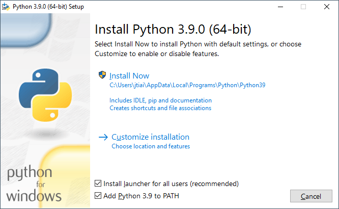

First steps
===========

Python
------

Python is very popular programming language with multiple uses.

Python originated in 1980s and it's main goal is to be readable by human
beings (not only machines). This is why it looks simpler than other
programming languages, but don't worry - Python is very powerful!

To work with Python and Pygame you need to install few tools first to make
workflow much more pleasant.

Installation
------------

Even Pygame itself is written mostly in C, it is written for Python and thus
Python is required for use of Pygame.

.. rst-class:: html-toggle

Install Python: Windows
-----------------------

First check wether your computer is running a 32-bit version or a 64-bit
version of Windows, on the "System type" line of System Info page. To
reach this page, try one of these methods:

* Press Windows key and Pause/Break key at the same time
* Open your Control Panel from the Windows menu, then navigate to
  System & Security, then System
* Press the Windows button, then navigate to Settings -> System ->
  About

You can download Python for Windows from the website 
https://www.python.org/downloads/windows/. Download latest version 
available. At the time of writing it that is 3.8.0. If your computer is
running **64-bit** windows download **Windows x86-64 executable installer**.
Otherwise doanload **Windows x86 executable installer**. After downloading
installer, you should run (double-click on it) and follow the instructions
here.

One thing to watch out for: During the installation, you will notice a window
marked "Setup". Make sure you tick "Add Python 3.8 to PATH" checkbox and click
on "Install Now", as shown here:

Verification
------------

Once installation is successful verify it by opening command-line
and run following command:

.. code-block::

    $ python --version
    Python 3.8.0

Pipenv
------

Pipenv is powerful command-line tool to manage both virtual environment
and Python packages installed to it.

Virtual environment isn't absolutely necessary when working with Python
but it is a great help. Virtual environment function is to create completely
separated and isolated environment to install Python packages. This allows
for example testing newer versions of packages without fear of breaking
all existing software.

For more about pipenv see https://pipenv.kennethreitz.org/en/latest/

Install pipenv globally using command ``pip install pipenv``. You should see
something similar as following:

.. code-block::

    $ pip install pipenv
    Collecting pipenv
    Using cached https://files.pythonhosted.org/packages/13/b4/3ffa55f77161cff9a5220f162670f7c5eb00df52e00939e203f601b0f579/pipenv-2018.11.26-py3-none-any.whl
    Collecting virtualenv-clone>=0.2.5 (from pipenv)
    Using cached https://files.pythonhosted.org/packages/ba/f8/50c2b7dbc99e05fce5e5b9d9a31f37c988c99acd4e8dedd720b7b8d4011d/virtualenv_clone-0.5.3-py2.py3-none-any.whl
    Requirement already satisfied: setuptools>=36.2.1 in c:\users\jani\appdata\local\programs\python\python38\lib\site-packages (from pipenv) (41.2.0)
    Collecting virtualenv (from pipenv)
    Using cached https://files.pythonhosted.org/packages/62/77/6a86ef945ad39aae34aed4cc1ae4a2f941b9870917a974ed7c5b6f137188/virtualenv-16.7.8-py2.py3-none-any.whl
    Collecting certifi (from pipenv)
    Using cached https://files.pythonhosted.org/packages/b9/63/df50cac98ea0d5b006c55a399c3bf1db9da7b5a24de7890bc9cfd5dd9e99/certifi-2019.11.28-py2.py3-none-any.whl
    Requirement already satisfied: pip>=9.0.1 in c:\users\jani\appdata\local\programs\python\python38\lib\site-packages (from pipenv) (19.2.3)
    Installing collected packages: virtualenv-clone, virtualenv, certifi, pipenv

