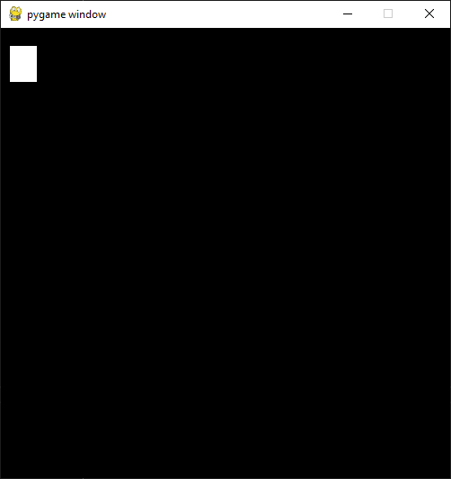

.. _pygameintroduction:

Introduction to Pygame
======================

Now you should be comfortable with the Python and using the command-line. It
is time to start get hands dirty with the Pygame.

Creating workspace
------------------

Before you begin you should create a workspace. A workspace means a place
where you put all the files belonging to your project - in this case files for
the Pygame tutorial. In the Python tutorial chapter you used your desktop
as a workspace but in the long run you don't want to put all your files on 
your desktop.

First you should create an umbrella directory under your home directory called
``pygame-projects``. Under that directory you will be creating other
directories (workspaces) to contain your Pygame projects, including this tutorial.

Creating workspace: Windows
---------------------------

Open up Windows Command Prompt and type:

.. code-block:: winbatch

    > cd %HomePath%
    > mkdir pygame-projects

No you have created an umbrella directory. You only need to do this once for your
computer.

As next you need to create the workspace for the project. You can call it
``pygame-tutorial``. Before you do that, ensure that you changed your current
directory to ``pygame-projects`` and then create the workspace directory:

.. code-block:: winbatch

    > cd pygame-projects
    > mkdir pygame-tutorial

Now your directories and the workspace are ready for Pygame installation. So
please keep your command-line open for further steps.

Pygame installation
-------------------

Time to install Pygame. In command-line you need to step into directory 
``pygame-tutorial``. If you have command-line open from previous step it is as
simple as:

.. code-block:: winbatch

    > cd pygame-tutorial

If you accidentally closed your command-line or you're returning to tutorial
you can type in the full path:

.. code-block:: winbatch

    > cd %HomePath%\pygame-projects\pygame-tutorial

Now you remember that in :ref:`firststeps` section one of the tools for
Python you installed was ``pipenv``? It is time to put it in the use.

Make sure that you are in the ``pygame-tutorial`` directory, type in the
following command:

.. code-block:: winbatch

    > pipenv install pygame==2.0.0dev6

The ``pipenv`` command does several things at once. At the first time it may
take a long time to run since it builds up some caches. So what happens when
you run the command? First pipenv creates a virtual environment. Then it
downloads and installs specific version of Pygame for you (2.0.0dev6 in this
case). As last it checks all the dependencies for Pygame and installs them
if necessary.

You should see the output similar to following:

.. code-block::

    Creating a virtualenv for this project…
    Pipfile: C:\Users\user\pygame-projects\pygame-tutorial\Pipfile
    Using c:\users\user\appdata\local\programs\python\python38\python.exe (3.8.0) to create virtualenv…
    [====] Creating virtual environment...Already using interpreter c:\users\user\appdata\local\programs\python\python38\python.exe
    Using base prefix 'c:\\users\\user\\appdata\\local\\programs\\python\\python38'
    New python executable in C:\Users\user\.virtualenvs\pygame-tutorial-5se6izmW\Scripts\python.exe
    Installing setuptools, pip, wheel...
    done.

    Successfully created virtual environment!
    Virtualenv location: C:\Users\user\.virtualenvs\pygame-tutorial-5se6izmW
    Creating a Pipfile for this project…
    Installing pygame==2.0.0dev6…
    Adding pygame to Pipfile's [packages]…
    Installation Succeeded
    Pipfile.lock not found, creating…
    Locking [dev-packages] dependencies…
    Locking [packages] dependencies…
    Success!
    Updated Pipfile.lock (14f5b3)!
    Installing dependencies from Pipfile.lock (14f5b3)…
    ================================ 1/1 - 00:00:00
    To activate this project's virtualenv, run pipenv shell.
    Alternatively, run a command inside the virtualenv with pipenv run.

Verification
------------

To verify that Pygame was installed successfully type the following:

.. code-block:: winbatch

    > pipenv run python -c "import pygame"
    pygame 2.0.0.dev6 (SDL 2.0.10, python 3.8.0)
    Hello from the pygame community. https://www.pygame.org/contribute.html

That indicates successful installation and you've verified the Pygame
installation.

.. note::

    In case of installation problems, for example if these instructions
    are outdated, please see https://www.pygame.org/wiki/GettingStarted.

Initialization and a gameloop
-----------------------------

Now open up the code editor and create a new file. Save the file as empty to
the workspace directory using name ``pygame_tutorial.py``. Make sure that
the filename ends with the ``.py`` extension.

You can verify that the file exists by typing the following:

.. code-block:: winbatch

    > dir /b

You should see output like the following:

.. code-block::

    Pipfile
    Pipfile.lock
    pygame_tutorial.py

For the Pygame to actually do anything useful you need write a few lines of code.

.. code-block:: python

    import pygame as pg

``import`` command tells Python that "find me a thing with a given name and
load it for use" (in reality it's much more complex process).

``as pg`` tells again to Python that instead of name ``pygame`` you will refer
it to as ``pg``. This saves some typing since instead of all the time writing
``pygame`` you can just need to type ``pg``.

.. note::

    Examples and source codes in the internet does Pygame import in the two 
    different ways. More common is just ``import pygame`` but that requires
    writing ``pygame`` all the time.

    You just want to save typing same few characters over and over again.

After importing Pygame youu need to initialize it. In the simplest form
you can use:

.. code-block:: python

    pg.init()

That will initialize Pygame as completely as possible (video, audio, input, etc.).

As next you need to setup display. Setting up display is done by using Pygame
submodule ``display`` and it's function ``set_mode()``:

.. code-block:: python

    pg.display.set_mode([500, 500])

The first parameter for the ``set_mode()``  is a width and a height as a list.
Width and height units are pixels.

Now your complete file should look like the following:

.. code-block:: python

    import pygame as pg
    pg.init()
    pg.display.set_mode([500, 500])

Save the file and run it:

.. code-block:: winbatch

    > pipenv run python pygame_tutorial.py
    pygame 2.0.0.dev6 (SDL 2.0.10, python 3.8.0)
    Hello from the pygame community. https://www.pygame.org/contribute.html

You might see the Pygame window popping up and then disappearing. Why is that
happening?

That happens because your code is missing the **gameloop**. A gameloop is 
a loop that runs as long as necessary to keep your game running. A minimalistic
gameloop looks like the following:

.. code-block:: python

    while True:
        event = pg.event.poll()
        if event.type == pg.QUIT:
            exit()

``while`` loop works almost like the ``for`` loop from the tutorial. ``while`` 
loop executes following intended lines as long as condition after ``while`` is
true. In the above code it means that ``while`` loop is run "forever".

``pg.event.poll()`` polls single event from Pygame event queue. Events and event
queue is explained later. The program stores polled event in the ``event`` variable.

Finally program checks if event type was ``pg.QUIT`` meaning that the Pygame
requests your game to stop running. You already used ``exit()`` command
to exit from Python console and the same function can be used to exit the program.

Now your file should look like the following:

.. code-block:: python

    import pygame as pg
    pg.init()
    pg.display.set_mode([500, 500])
    while True:
        event = pg.event.poll()
        if event.type == pg.QUIT:
            exit()

When you save the file and run it:

.. code-block:: winbatch

    > pipenv run python pygame_tutorial.py
    pygame 2.0.0.dev6 (SDL 2.0.10, python 3.8.0)
    Hello from the pygame community. https://www.pygame.org/contribute.html

You should see Pygame window appearing and staying visible. When you click 'X'
to close window application closes. Congratulations! You have done your first
Pygame application.

Events
------

In your first pygame application you polled events from event queue. Pygame has
an event queue which holds all kinds of events happening on the background. 
There are events like ``pg.QUIT`` but also events that handles keyboard, mouse,
joystick or game controller, video and few others. And there is also a way to
define user events.

When an event happens it is actually placed in a list of events. The list, or 
actually queue, works so that when even it read, oldest one is returned to 
the event reader. New events are place at the other end of the list.

.. note::

    Event list (the queue) has maximum length. After list is full, no new
    events can be added to it.
    
    You need to make sure that you poll events fast enough not to cause event
    queue to fill up.

Events do have ``properties``. A property is readable and sometimes writable
attribute of some object. Event object has always at least one property called
``type``. In minimalistic gameloop only event type used was ``pg.QUIT``.

Common way to handle all events from the queue is to use ``for`` loop to
get events:

.. code-block::

    for event in pg.event.get():
        if event.type == pg.QUIT:
            exit()

As you see code is only slightly different than previous one. ``for`` loop uses
``pg.event.get()`` which returns a list of all events that has occurred since
last time ``for`` loop was executed.

How about handling a keyboard? Let's say that you want to set ``space`` key to
do jump for player. Code for that would look like the following:

.. code-block::

    if event.type == pg.KEYDOWN and event.key == pg.K_SPACE:
        print("Jump!")

``if`` in above code uses two ``properties``. First property is the common
``type`` and because now code tested key down event ``pg.KEYDOWN`` there exists
also second property the ``key``. The ``key`` contains integer value of key
which was pressed down. Unfortunately you don't have to remember values
because Pygame provides easily memorable ``constants``.

.. note::

    Full list of keys can be found at https://www.pygame.org/docs/ref/key.html#key-constants-label

Now the full program should look like the following:

.. code-block:: python

    import pygame as pg
    pg.init()
    pg.display.set_mode([500, 500])
    while True:
        for event in pg.event.get():
            if event.type == pg.QUIT:
                exit()
            if event.type == pg.KEYDOWN and event.key == pg.K_SPACE:
                print("Jump!")

Save the file and run it. Hit ``space``-key few times and you should see text
"jump" in the command-line.

.. code-block:: winbatch

    > pipenv run python pygame_tutorial.py
    pygame 2.0.0.dev6 (SDL 2.0.10, python 3.8.0)
    Hello from the pygame community. https://www.pygame.org/contribute.html
    Jump!
    Jump!

For the fun try to add other keys as well.

Summary
-------

You now have learned basics of the Pygame:

- How to install Pygame using pipenv
- How to initialize pygame with ``init()``
- Events and event queue
- How to read keypress

Surfaces
--------

Now it is finally time to see some graphics!

In Pygame graphics are dealt with surfaces. A surface is special type of image
in memory. You can do various operations on surfaces like draw on them, rotate
resize, recolor etc. 

The screen, which is displayed to you, is also a surface. In the current 
version of project you haven't assigned screen surface to any variable, so you
need to change display setup as the following:

.. code-block:: python

    screen = pg.display.set_mode([500, 500])

The ``set_mode()`` returns the screen surface. It means that you can do
operations on the screen surface. Try drawing the rectangle:

.. code-block:: python

    pg.draw.rect(screen, (255, 255, 255), ((10, 20), (30, 40)))

``pg.draw.rect()`` draws a rectangle. It takes in quite a set parameters and
as you can see there are quite many parenthesis. Parameters are:
    - ``screen`` - a surface to draw rectangle to, in this case you draw
      directly on to screen.
    - ``(255, 255, 255)`` - A color triplet. Each number represents one value of
      RGB component constiting of single color. Values are from 0 to 255. If
      all values are 0, it's black, if all values are 255 color will be white.
    - ``((10, 20), (30, 40))`` - Rectangle to draw first pair of numbers ``(10, 20)``
      are the position on the screen surface. ``(0, 0)`` would upper left corner.
      Rectangle is drawn 10 pixels on x-axis from left border and 20 pixels
      down from top of the screen. Second pair of numbers ``(30, 40)`` are 
      the width and the height of the rectangle in pixels.

If you run your application now it runs but there are no rectangle visible.

By default Pygame uses so-called *double buffering*. It means that Pygame uses
actually two surfaces - one for drawing, one for displaying. Once you have
completed drawing on a hidden surface you need to tell Pygame to "flip" the 
surfaces. Then Pygame copies drawing surface to display surface and you'll see
your drawing - the white rectangle.

At the end of the gameloop add the following:

.. code-block:: python

    pg.display.flip()

At this point your full code should look like the following:

.. code-block:: python
    
    import pygame as pg
    pg.init()
    screen = pg.display.set_mode([500, 500])
    pg.draw.rect(screen, (255, 255, 255), ((10, 20), (30, 40)))
    while True:
        for event in pg.event.get():
            if event.type == pg.QUIT:
                exit()
            if event.type == pg.KEYDOWN and event.key == pg.K_SPACE:
                print("Jump!")
        pg.display.flip()

And when you save the file and run it you should see the following window:

Rects
-----

When drawing rectangle you had to give coordinates and size of the rectangle
as last parameter for ``pg.draw.rect()``. The last parameter is actually
a ``Rect`` object.

A rect is a definition of rectangular area. When creating a rect you need to
give four attributes as following:
- location - ``x`` and ``y``.
- size - ``width`` and ``height``.

You can define those like the following:

.. code-block:: python

    rect = pg.Rect((240, 240), (20, 20))

The code above will create you a new ``Rect`` object with given location and
dimensions. Rect has set of ``properties`` that you can read and write to 
modify for example location. How about changing ``space`` key to make your
rectangle teleport to an another location?

You can a rect properties to change your rectangle location. To achieve
that you can now use ``x`` and ``y`` properties of the rect to change it to a
new location. Modify your program as the following:

.. code-block:: python

    import pygame as pg
    import random
    pg.init()
    screen = pg.display.set_mode([500, 500])
    rect = pg.Rect((240, 240), (20, 20))
    while True:
        for event in pg.event.get():
            if event.type == pg.QUIT:
                exit()
            if event.type == pg.KEYDOWN and event.key == pg.K_SPACE:
                rect.x = random.randrange(0, 479)
                rect.y = random.randrange(0, 479)
        pg.draw.rect(screen, (255, 255, 255), rect)
        pg.display.flip()

Save the file and run it. Try to press space few times. You see new rectangles
appear but old ones stay. Why is that?

That is because you don't clear the drawing surface. When flipping the screen
pygame just copies hidden drawing surface to the display surface. So it's up
to you to clear the drawing surface. The simplest way to do that is to fill
the whole drawing surface with a background color, in your case with the black.

So add the following just before drawing the rect:

.. code-block:: python

    screen.fill((0, 0, 0))

The code above fills the whole screen surface with the black color. 

Now your complete code should look like the following:

.. code-block:: python
   
    import pygame as pg
    import random
    pg.init()
    screen = pg.display.set_mode([500, 500])
    rect = pg.Rect((240, 240), (20, 20))
    while True:
        for event in pg.event.get():
            if event.type == pg.QUIT:
                exit()
            if event.type == pg.KEYDOWN and event.key == pg.K_SPACE:
                rect.x = random.randrange(0, 479)
                rect.y = random.randrange(0, 479)
        screen.fill((0, 0, 0))
        pg.draw.rect(screen, (255, 255, 255), rect)
        pg.display.flip()

Save the file and run it. Hit space to make your rectangle to teleport new
locations on the screen!

``Rect`` has several properties that you can read and write, here is the
complete list:

.. table::
    :align: left
    :column-dividers: none single

    =========== ===========
    Property    Explanation
    =========== ===========
    x           x - coordinate
    y           y - coordinate
    top         top - coordinate (same as y)
    left        left - coordinate (same as x)
    bottom      bottom - coordinate
    right       right - coordinate
    topleft     (x, y) - coordinate pair of top left corner
    bottomleft  (x, y) - coordinate pair of bottom left corner
    topright    (x, y) - coordinate pair of top right corder
    bottomright (x, y) - coordinate pair of bottom right corder
    midtop      (x, y) - coordinate pair of middle of top edge
    midleft     (x, y) - coordinate pair of middle of left edge
    midbottom   (x, y) - coordinate pair of middle of bottom edge
    midright    (x, y) - coordinate pair of middle of right edge
    center      (x, y) - coordinate pair of center of rect
    centerx     x - coordinate of center of rect
    centery     y - coordinate of center of rect
    size        (w, h) - width and height pair of rect
    width       width of rect
    height      height of rect
    w           width of rect
    h           height of rect
    =========== ===========

Blitting
--------

Blitting is a term that is used in the context of Pygame to mean copying 
surfaces. Blitting always requires two components the source surface and 
the destination surface. In Pygame ``Surface`` is actually an object and
it has method ``blit()``.

Since drawing rectangle is an expensive operation, doing that all the time is
not efficient programming. Instead of that you will now create a surface 
that will be the rectangle:

.. code-block:: python

    square = pg.Surface((20, 20))
    square.fill((255, 255, 255))
    rect = square.get_rect()

``pg.Surface((20, 20))`` creates 20 pixels wide and 20 pixels height surface.
It's exactly same sized as your rectangle in the previous code.
``square.fill((255, 255, 255))`` should be familiar already. This time ``fill()``
fills whole square with white color. You could have used
``pg.draw.rect(square, (255, 255, 255), ((0, 0), (20, 20))`` as well.
Finally you get a rect from your surface - the square.

Since there is no more need to draw rectangle all the time using ``pg.draw.rect``
you will be doing the blitting.

.. code-block:: python

    screen.blit(square, rect)

``screen`` is your screen surface and because you call method ``blit`` on ``screen``
surface it will be the destination. The first parameter for ``blit()`` is the
source surface - square in this case. The second parameter is rectangle describing
where to copy ``square``.

So above code reads "copy ``square`` to ``screen`` at location ``rect``".

Your full code should look like the following:

.. code-block:: python

    import pygame as pg
    import random
    pg.init()
    screen = pg.display.set_mode([500, 500])
    square = pg.Surface((20, 20))
    square.fill((255, 255, 255))
    rect = square.get_rect()
    while True:
        for event in pg.event.get():
            if event.type == pg.QUIT:
                exit()
            if event.type == pg.KEYDOWN and event.key == pg.K_SPACE:
                rect.x = random.randrange(0, 479)
                rect.y = random.randrange(0, 479)
        screen.fill((0, 0, 0))
        screen.blit(square, rect)
        pg.display.flip()

Summary
-------

Congratulations! Now you do have basic knowledge of Pygame and it's concepts.

- surfaces - you know what they are and how to create new surfaces.
- rects - how to create, manipulate use them.
- blitting - how to copy images to screen.
